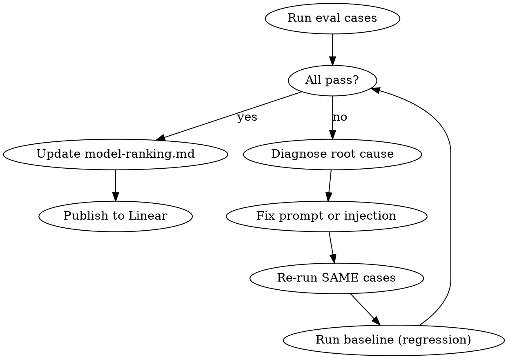

# Agent Evals

## Overview

`devtools/agent-evals/` runs real agent executions against PGlite for end-to-end testing and model comparison. No vitest, no mocks — real DB, real LLM, real tool execution.

See [cli-reference.md](references/cli-reference.md) for full CLI commands, ScenarioConfig type, MCP/bot/matrix setup, and assertion API.
See [model-ranking.md](references/model-ranking.md) for current model tier rankings per scenario.
See [linear-workflow.md](references/linear-workflow.md) for how to write, publish, and follow up eval results on Linear.

## When to Use

- Running or creating eval scenarios for agent behavior
- Iterating on prompts (systemRole, toolSystemRole, context engine) to improve pass rates
- Comparing model performance across scenarios
- Debugging why an eval case fails
- Publishing eval results to Linear

**When NOT to use:**

- Unit testing individual functions → use Vitest
- Manual QA in browser → use dev server directly
- Testing non-agent features (UI, API routes)

## Quick Start

```bash
bun run agent-evals run web-onboarding-v3 --case-id fe-intj-crud-v1 --no-matrix --model gpt-5.4-mini
bun run agent-evals run web-onboarding-v3 --all-cases
bun run agent-evals list
```

Use `--no-matrix` for fast single-model iteration. Enable matrix only for final validation.

## Eval Iteration Workflow



### Diagnose Root Cause

Classify failures into three layers:

**Layer 1 — Prompt issue (systemRole / toolSystemRole)**

- Symptoms: Tool calls happen but wrong order, missing specific ones, ignores completion signals
- Fix: `lobehub/packages/builtin-agent-onboarding/src/systemRole.ts` or `toolSystemRole.ts`

**Layer 2 — System injection issue (context engine)**

- Symptoms: Model never calls a tool despite prompt telling it to, phase stuck, `<next_actions>` never instructs the right action
- Fix: `lobehub/packages/context-engine/src/providers/OnboardingActionHintInjector.ts`
- Key: `<next_actions>` is the ONLY thing that tells the model which tools to call each turn. If a tool is never mentioned for the current phase, the model will never call it.

**Layer 3 — Model capability issue**

- Symptoms: Zero tool calls, ignores `<next_actions>` entirely, pure text despite tool availability, prompt changes have no effect
- Fix: Switch model. No prompt fix compensates for model inability in long context.

### Fix and Re-run

1. Fix the root cause
2. Re-run the **exact same failing cases**
3. Run **baseline cases** for regression check:

```bash
bun run agent-evals run web-onboarding-v3 \
  --case-id fe-intj-crud-v1,pm-enfp-collab-v1,be-istp-reliability-v1,da-intj-automation-en-v1,designer-infp-creative-ja-v1 \
  --no-matrix --model gpt-5.4-mini
```

### Update Model Ranking

After all cases pass (or after a matrix run), update [model-ranking.md](references/model-ranking.md):

- Add/update the ranking table under the scenario section
- Update the date
- Add new baseline cases if introduced

### Publish to Linear

See [linear-workflow.md](references/linear-workflow.md) for the full workflow: issue structure, publishing commands, and follow-up steps.

## Key Files

| File                                                    | Role                                |
| ------------------------------------------------------- | ----------------------------------- |
| `devtools/agent-evals/scenarios/*.ts`                   | Scenario configs + assertions       |
| `devtools/agent-evals/datasets/onboarding/golden-v1.ts` | Test cases (baseline + extreme)     |
| `lobehub/.../systemRole.ts`                             | Conversation flow prompt            |
| `lobehub/.../toolSystemRole.ts`                         | Tool usage rules prompt             |
| `lobehub/.../OnboardingActionHintInjector.ts`           | Per-turn `<next_actions>` injection |
| `lobehub/src/server/services/onboarding/index.ts`       | Phase derivation (`derivePhase`)    |

## Common Mistakes

| Mistake                                | Fix                                                              |
| -------------------------------------- | ---------------------------------------------------------------- |
| Only change prompt wording             | Check if `<next_actions>` even mentions the tool for that phase  |
| Skip baseline regression check         | Edge case fixes can break happy path                             |
| Compare across different judge models  | gpt-4o-mini scores ≠ gpt-5.4-mini scores — always use same judge |
| Run full matrix during iteration       | `--no-matrix` + single model for speed; matrix for final only    |
| Assume prompt fix works for all models | Test at least 2 models                                           |
